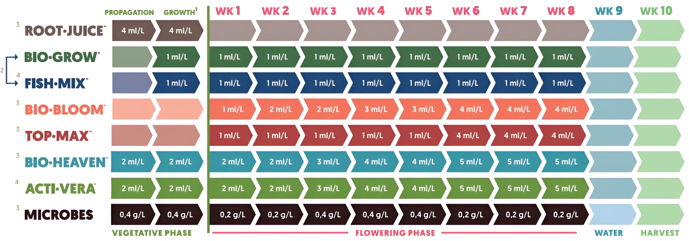

# Biobizz Calculator

BioBizz All-Mix Dünger Rechner – berechnet die Düngermenge (ml) je nach Woche und Wassermenge.

**Live:** https://vsvito420.github.io/biobizz/

Reines HTML/CSS/JS, keine Build-Schritte. Lokal starten: `python3 -m http.server` und `http://localhost:8000` öffnen.

